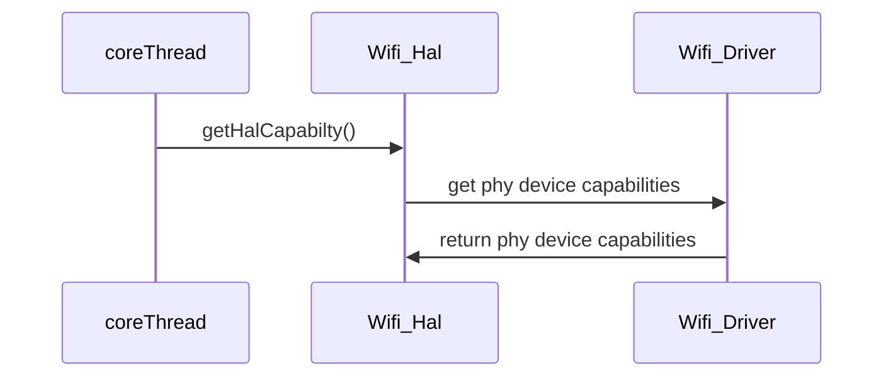

# RDKB Wifi HAL Documentation

## Version History

| Date | Author | Comment | Version |
| --- | --- | --- | --- |
| 07/28/22 | M. Kandasamy | Draft | 0.0.1 |

## Acronyms

- `HAL` \- Hardware Abstraction Layer, may include some common components
- `HAL.h` \- Abtracted defined API to control the hardware
- `HAL.c` \- Implmentation wrapper layer created by the `OEM` or `SoC` Vendor.
- `RDK` \- Reference Design Kit for All Devices
- `RDK-B` \- Reference Design Kit for Broadband Devices
- `Wi-Fi` \- Wireless Radio Ntworking
- `HATS` \- HAL Automated Testing System
- `OEM` \- Origional Equipment Manufactuer (Sky is also an OEM)
- `SoC` \- System on a Chip

## Description

The Hardware Abstraction Layer (HAL) is to abstract the RDK Wi-Fi requirements at a general level to allow platform independant control.

The picture below shows the realtionship between the `HAL` and the `Kernel` and `WiFi Driver`.

@TODO: Draw picture here for how the kernel / hal / driver relate to each other.

# Component Runtime Execution Requirements

It should be statically loadable library. There should one HAL interface for the system.

The lifetime of which shall exists throughout the lifetime of process.

Failure to meet these requirements will likely result in undefined and unexpected behaviour.

## Initialization and Startup

Initialize the Wifi `HAL` using `wifi_init()` before making any other calls.

The kernel boot sequence is expected to start all the dependencies for the wifi hal.

## Threading Model

`HAL` is expected to be thread safe.

There is no restriction on the vendor to create any number of threads to meet the operational requirements.

## Process Model

A single instance is expected to exist. And only once instance will be initialised.

## Memory Model

Where `HAL` creates any memory, then `HAL` will be expected to own it.
Where `client` creates memory, then `client` is expected to own it.

Expection to the rules above are specified in the API documentation.

## Power Management Requirements

There is no requirement for the component to participate in power management.

## Asynchronous Notification Model

There are a number of asynchronous callback registration functions these are defined by `xxx_callback_register()`
and marked in the doxygen comments with token `@execution callback`

As a few examples of this are:-

- For asynchronous management frames transmission - `wifi_mgmt_frame_callbacks_register()`
- For asynchronous notification on client connection - `wifi_newApAssociatedDevice_callback_register()`
- For asynchronous notification on client deauthentication - `wifi_apDeAuthEvent_callback_register()`
- For asynchronous notification on client dissocciation - `wifi_apDisassociatedDevice_callback_register()`
- For asynchronous notification on client connection status - `wifi_staConnectionStatus_callback_register()`
- For asynchronous notification on client scan results - `wifi_scanResults_callback_register()`

During callbacks the client is responsible for create a copy of data, unless otherwise specified in the API documentation.

## Blocking calls

There is a number of blocking calls in the API docuemtation, thense are tagged with the `@execution blocks/blocking` token in the documentation.

## Internal Error Handling

All the APIs define a list return codes, each API must be capable of returning all of the codes defined, the `HTS` if possible will create cases
for the error codes to be exercised.

HAL is responsible to handle system errors (e.g., failure of memory allocation, array boundary out of memory, return code check), and returning
only the fixed returned codes as defined in the `API` specification.

## Persistence Model

WiFi HAL interface expected to persist configuration set by calls to the HAL interface.

This configuration should also persist if the device firmware upgraded or downgraded.

During the initialization the driver will retrieve configuration and re-apply it.

The vendor must have the capability of a separate factory reset configuration, this will be configured at factory programming.

A reset flag is normally read during boot initialization and applys the configuration accordingly.

# Non functional requirements

Following non-functional requirement should be supported by the component.

## Logging and debugging requirements

The component should log all the error and critical informative messages.
This helps to debug/triage the issues and understand the functional flow of the system.

The log files have naming convention depends upon the type of log. 

There are few requirements of redirecting logs to specified files.

E.g.

1. Wifi initialization log file name - WiFilog.txt.0
2. Wifi telemetry related log file name - wifihealth.txt
3. Device Image version - version.txt
4. Wifi HAL log file name - wifi_vendor_hal.log

## Memory and performance requirements

During idle and Standby, memory and CPU utilization will be a minimal footprint.

Under maxiumum load CPU should aim for under 85% usage, and a max memory footprint of xMB.

## Quality Control

The vendor should endaviour to:-

- Run a static analysis tool like Coverity
- Have a zero warning policy with regards to compling. All warnings should be enabled by default in the makefiles.
- Use of memory analysis tools like Valgrind is encouraged, or identify leaks or corruptions.
- `HAL` Tests will endevour to create worst case scenrio's to assist investigations.

## Licensing

 Licensed under the Apache License, Version 2.0 (the "License").
 you may not use this file except in compliance with the License.

## Build Requirements

The source code should be built under Linux environment using `cmake`, `make`, `gcc`, etc. as required, and would normally be delivered as a library.

## Variability Management

Ideally the source code should be delivered into comcast/sky git repoistories and tagged based on the requirements for the project.
The vendor will follow the `comcast federatated delivery model` whereever possible.

Compile time flags `config` flags can control compliation:-

example of this would be :-

```
#ifdef HUB4 && HUB5 && HUB6
 .. do wifi V6
#else
 .. no wifi
#endif
```

`config` flags are encouraged, so this can be defined at the top level compile time

```
#ifdef CONFIG_WIFI_V6
 .. do wifi v6
#else
.. no v6
#enidf
```

The interface will maintain `getCapabilities()` functionality, and the upper layers will use this to determine available features.

# Interface API Documentation

The interface is documented by Doxygen and will be included with this document.

## Theory of operation and key concepts

Covered as per "Description" sections in the API documentation.

## Diag



### Sequence Diagram - 1


### Sequence Diagram - 2 


