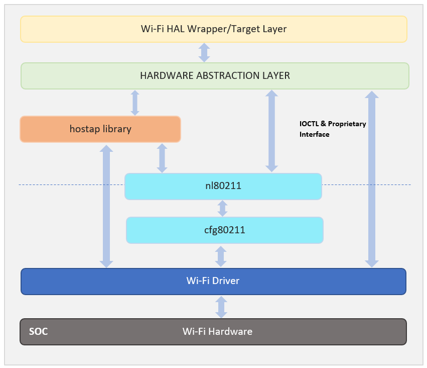
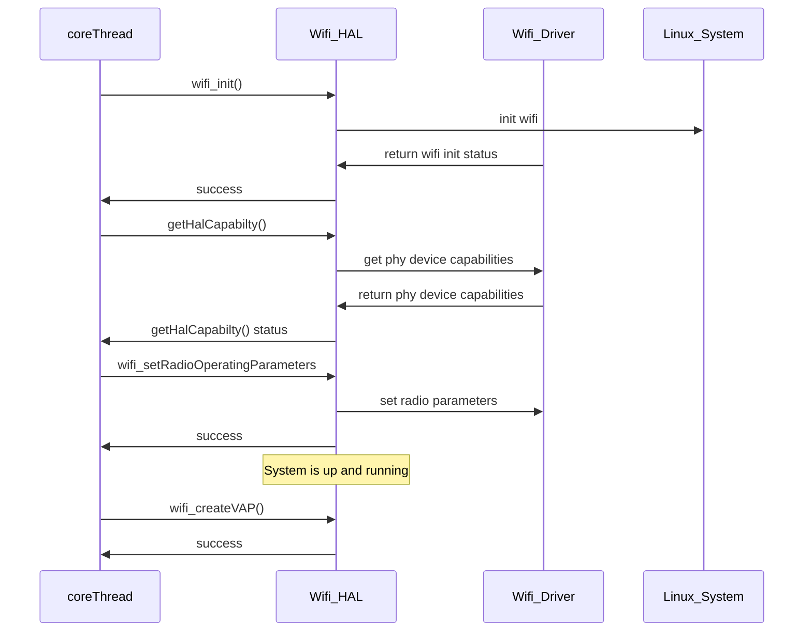

# RDKB Wifi HAL Documentation

## Version History

| Date | Author | Comment | Version |
| --- | --- | --- | --- |
| 08/16/22 | M. Kandasamy | Initial Release | 0.1.0 |

## Acronyms

- `HAL` \- Hardware Abstraction Layer, may include some common components
- `HAL.h` \- Abstracted defined API to control the hardware
- `HAL.c` \- Implementation wrapper layer created by the `OEM` or `SoC` Vendor
- `RDK` \- Reference Design Kit for All Devices
- `RDK-B` \- Reference Design Kit for Broadband Devices
- `Wi-Fi` \- Wireless Radio Networking
- `HATS` \- HAL Automated Testing System
- `OEM` \- Original Equipment Manufacturer 
- `SoC` \- System on a Chip

## Description

The Hardware Abstraction Layer (HAL) is to abstract the RDK Wi-Fi requirements at a general level to allow platform independent control.

The picture below shows the relationship between the `HAL`, `Kernel` and the `WiFi Driver`.


## Optional Components

The following components are optional and its upto vendors discretion.

- `hostapd` (host access point daemon) is a user space daemon software enabling a network interface card to act as an access point and authentication server

- `nl80211/cfg80211` nl80211 is the interface between user space software (iw etc.) and the kernel (cfg80211 and mac80211 kernel modules, and specific drivers)


# Component Runtime Execution Requirements

It should be statically loadable library. There should one HAL interface for the system.

The lifetime of which shall exists throughout the lifetime of process.

Failure to meet these requirements will likely result in undefined and unexpected behaviour.

## Initialization and Startup

Initialize the Wifi `HAL` using `wifi_init()` before making any other calls.

The kernel boot sequence is expected to start all the dependencies for the WiFi HAL.

## Threading Model

`HAL` is expected to be thread safe.

There is no restriction on the vendor to create any number of threads to meet the operational requirements.

## Process Model

A single instance is expected to exist. And only one instance will be initialised.

## Memory Model

Where `HAL` creates any memory, then `HAL` will be expected to own it.
Where `client` creates memory, then `client` is expected to own it.

Exceptions to these rules can be specified in the API documentation.

## Power Management Requirements

There is no requirement for the component to participate in power management.

## Asynchronous Notification Model

There are number of asynchronous callback registration functions these are defined by `xxx_callback_register()`
and marked in the doxygen comments with token `@execution callback`

As a few examples of this are:-

- For asynchronous management frames transmission - `wifi_mgmt_frame_callbacks_register()`
- For asynchronous notification on client connection - `wifi_newApAssociatedDevice_callback_register()`
- For asynchronous notification on client deauthentication - `wifi_apDeAuthEvent_callback_register()`
- For asynchronous notification on client dissocciation - `wifi_apDisassociatedDevice_callback_register()`
- For asynchronous notification on client connection status - `wifi_staConnectionStatus_callback_register()`
- For asynchronous notification on client scan results - `wifi_scanResults_callback_register()`

During callbacks the client is responsible for create a copy of data, unless otherwise specified in the API documentation.

## Blocking calls

None of the calls in the interface should block.

## Internal Error Handling

All the APIs define a list of return codes, each API must be capable of returning all of the codes defined, the `HTS` if possible, will create cases
for the error codes to be exercised.

HAL is responsible to handle system errors (e.g., failure of memory allocation, array boundary out of memory, return code check), and returning
only the fixed returned codes as defined in the `API` specification.

## Persistence Model

Wifi HAL configuration will be maintained by upper layer.

# Non functional requirements

Following non-functional requirement should be supported by the component.

## Logging and debugging requirements

The component should log all the error and critical informative messages.
This helps to debug/triage the issues and understand the functional flow of the system.

The logging should be consistance across all HAL components.

If the vendor is going to log then it has to be logged in `wifi_vendor_hal.log` file name.

Logging should be defined with log levels as per Linux standard logging.
## Memory and performance requirements

During idle and Standby, memory and CPU utilization will be a minimal footprint.

Refer to product specification for guidance on maximum CPU load average and memory requirements.

## Quality Control

The vendor should endeavour to:-

- Run a static analysis tool like Coverity etc
- Have a zero-warning policy with regards to compiling. All warnings should be enabled by default in the makefiles.
- Use of memory analysis tools like Valgrind are encouraged, to identify leaks/corruptions.
- `HAL` Tests will endeavour to create worst case scenarios to assist investigations

## Licensing

 Licensed under the Apache License, Version 2.0 (the "License").
 you may not use this file except in compliance with the License.

## Build Requirements

The source code should be built under Linux environment using `cmake`, `make`, `gcc`, etc. as required, and would normally be delivered as a library and source code.

## Variability Management

Ideally the source code should be delivered into Comcast/Sky git repositories and tagged based on the requirements for the project.
The vendor will follow the `Comcast federated delivery model` wherever possible.

Compile time flags `config` flags can control compilation:-

Example of this would be:-

`config` flags are encouraged, so this can be defined at the top-level compile time

```
#ifdef CONFIG_WIFI_V6
 .. do wifi v6
#else
.. no v6
#enidf
```

The interface will maintain `getCapabilities()` functionality, and the upper layers will use this to determine available features.

# Interface API Documentation

The interface is documented by Doxygen and will be included with this release.

## Theory of operation and key concepts

Covered as per "Description" sections in the API documentation.

## Sequence Diagram




