# RDKB Wi-Fi Stack

| Date | Author | Comment | Version |
| --- | --- | --- | --- |
| 25/07/22 | M. Kandasamy | Draft | 0.0.2 |

## Table of Contents

- [Overview](#overview)
- [Architecture](#architecture)
  - [Systems Architecture](#systems-architecture)
    - [Configuration Command Control](#configuration-command--control)
      - [WebConfig](#webconfig)
      - [Interaction With Webconfig Server](#interaction-with-webconfig-server)
    - [OVSDB Manager](#ovsdb-manager)
      - [OneWifi WebConfig Schema](#onewifi-webconfig-schema)
      - [Considerations for Schema Definition](#considerations-for-schema-definition)
      - [Device Type vs WebConfig Usecase Matrix](#device-type-vs-webconfig-usecase-matrix)
    - [Statistics](#statistics)
  - [OneWifi Internal Architecture](#onewifi-internal-architecture)
    - [Component Architecture](#component-architecture)
    - [OneWiFi Thread Management, Inter Thread Communication and Data Handling](#onewifi-thread-management-inter-thread-communication-and-data-handling)
    - [Core Functional Blocks Or Subsystem](#core-functional-blocks-or-subsystem)
    - [Core Thread Software Architecture](#core-thread-software-architecture)
    - [Apps Functional Blocks Or Subsystem](#apps-functional-blocks-or-subsystem)
- [Appendix](#appendix)
  - [OneWifi Schema Definition](#onewifi-schema-definition)
    - [SouthBound](#southbound)
    - [NorthBound](#northbound)
  - [Flow Diagram Or Pseudo Code](#flow-diagram-or-pseudo-code)
  - [Message Sequence Diagrams](#message-sequence-diagrams)
    - [Initialization](#initialization)
    - [Client Authentication](#client-authentication)

## Overview

In current deployment RDK WiFi systems is essentially an overlay of two systems that operate as an overlay on gateways and independently on extenders. The architecture on gateways is shown below on left and the architecture on extenders is on the right.

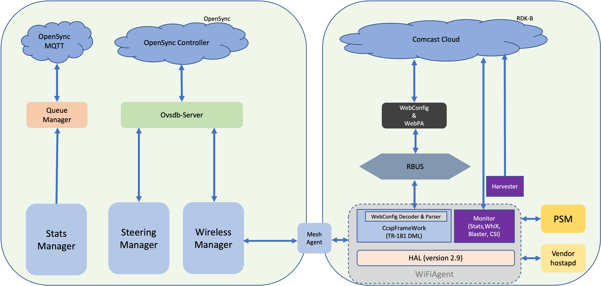
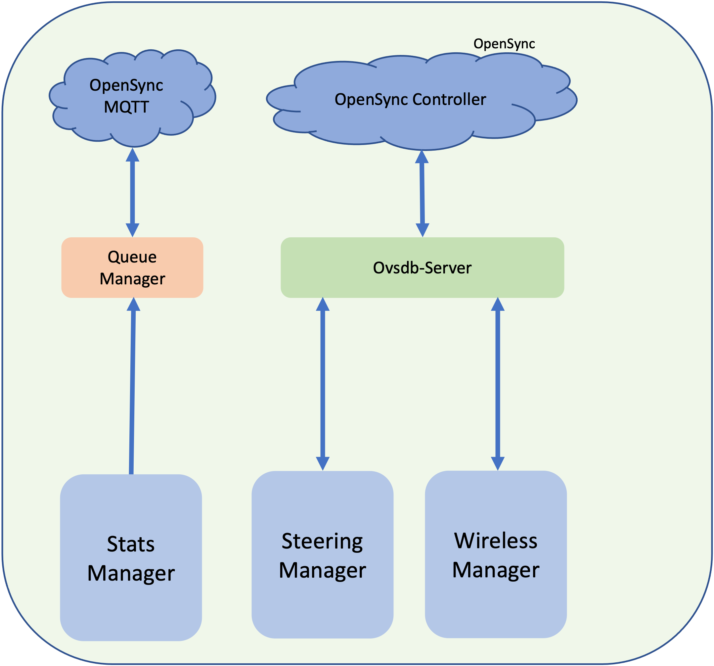

The purpose of OneWifi project is to create a unified software architecture that preserves control plane and stats level functionality but is capable of running on both gateways and extenders. The proposed unified architecture is depicted as below.

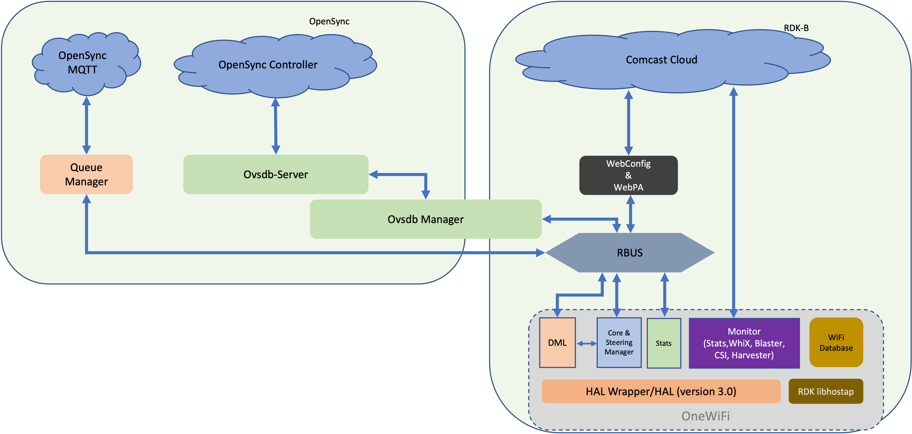

## Architecture

### Systems Architecture

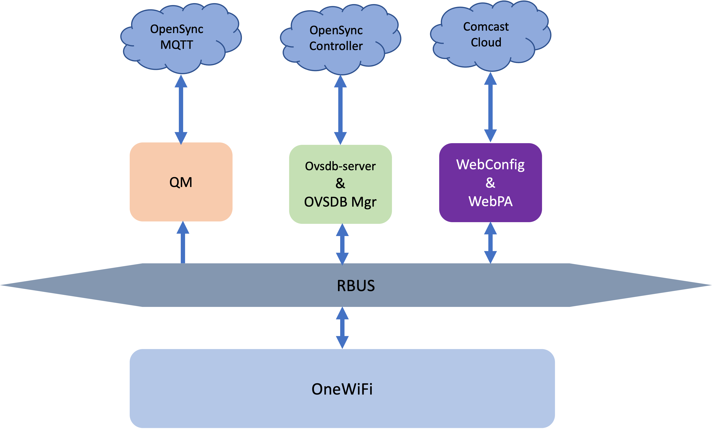

### Configuration, Command & Control

#### WebConfig

Cloud components can configure Wi-Fi parameters in gateway, extender or other Comcast controlled CPE running RDK-B using WebConfig or WebPA technology. Command parameters are specified in JSON schema formats that are populated with either default or operational parameters by Cloud components. Such JSON encoded command data is sent to RDK-B CPE and eventually received by OneWifi process by mechanisms of RBUS call backs. The data is decoded and applied to Wi-Fi drivers or baseband by making use of Wi-Fi HAL functions. Detail architecture of Wi-Fi Webconfig design and implementation can be found at Wi-Fi [WebConfig](rdkbWifiStackWebConfig.md)

### Interaction With WebConfig Server

Detail at <https://etwiki.sys.comcast.net/pages/viewpage.action?pageId=880673017>

## OVSDB Manager

Cloud controller can configure Wi-Fi parameters in gateway, extender or other Comcast controlled CPE using OVSDB & Manager entities. OVSDB is a database server that executes in RDK-B CPE. Any update of parameters in this database by cloud controller is notified to OneWifi process by OVSDB manager entity over RBUS. OneWifi process validates the parameter or set of parameters and applies the configuration in WiFi driver or baseband. If successfully applied, OneWifi also notifies OVSDB manager about the successful completion so that the database tables are updated with the right state of WiFi subsystem of the CPE.

### OneWifi WebConfig Schema

Please refer to schema definition in Appendix section

### Considerations for Schema Definition

Backward compatibility with legacy stack/schema
No disruption of WebConfig Use cases across old or new stack deployments on any platform.

### Device Type vs WebConfig Usecase Matrix

| **Type**  | **Private**                                         | **xfinity**                                                      | **Mesh**                                        |
|:-----------|:-----------------------------------------------------:|:------------------------------------------------------------------|-------------------------------------------------|
| **Mode** | xFi App                                             | Xfinity Configuration                                            | Enable mesh and/or first extender onboarding    |
| **VAP**   | Private VAP configurations on 2.4, 5 and 6GHz bands | Open and secure hotspot configurations.  GRE tunnel configurations | Client, backhaul and Private VAP configurations |
| **XB3**   | Yes                                                 | Yes                                                              | No                                              |
| **XB6**   | Yes                                                 | Yes                                                              | Yes                                             |
| **XB7**   | Yes                                                 | Yes                                                              | Yes                                             |
| **XB8**   | Yes                                                 | Yes                                                              | Yes                                             |
| **XEv1**  | No                                                  | No                                                               | No                                              |
| **XEv2**  | Yes                                                 | No                                                               | Yes                                             |
| **XLE**   | Yes                                                 | ?                                                                | Yes                                             |
| **BWG**   | Yes                                                 | Yes                                                              | No                                              |

### Statistics

(TODO : ??Need to check content for statistics)

## OneWifi Internal Architecture

### Component Architecture

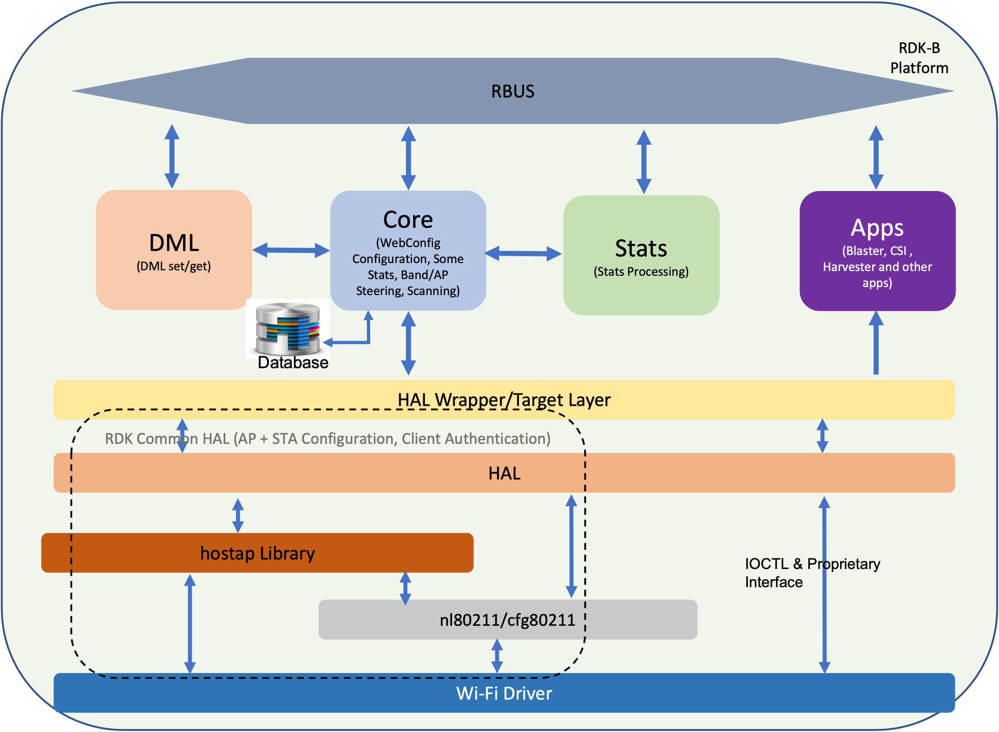

The internal functional entities of the OneWifi process are as shown in the above diagram. OneWifi software architecture is essentially a multi-threaded software architecture, the three main threads are

Core thread: this thread is the fundamental engine of the process that is responsible for all configuration of WiFi parameters, command/control/status response and WiFi state indications. The core thread is also responsible for steering related activities.
DML thread: this thread handles the TR-181 set/get handlers.
Apps thread: this thread is responsible for supporting all WiFi related application/features such as harvester, motion sensing, blaster, single client measurements etc.
The software architecture of working of each thread is detailed below.

### OneWiFi Thread Management, Inter Thread Communication and Data Handling

The diagram below depicts thread management and inter thread communication and data transfer in OneWifi. Threads essentially wait for condition and timeouts. If data needs to be processed, the data is posted into queue and the thread is signaled. The thread retrieves the data from the queue and processes the data.

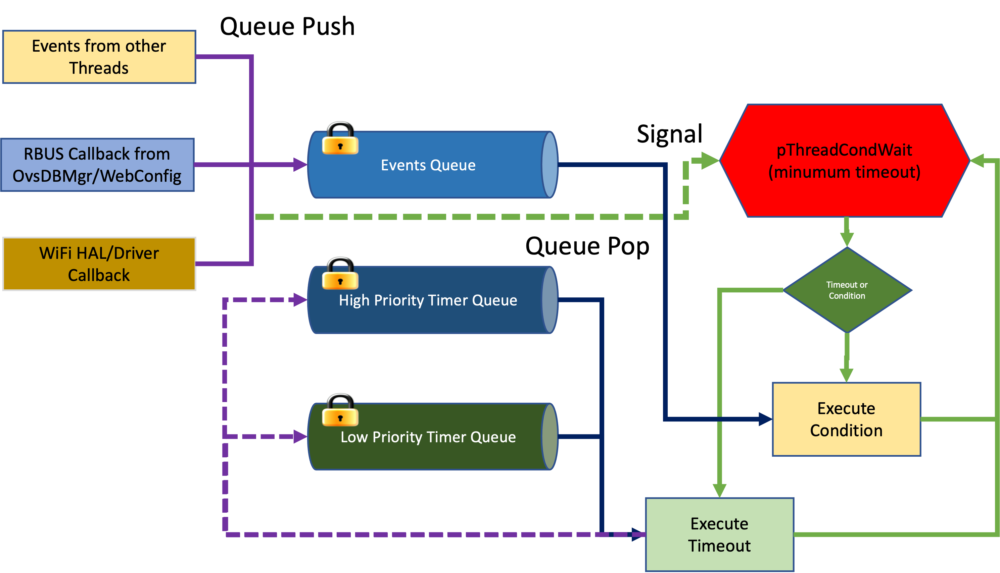

### Core Functional Blocks Or Subsystem

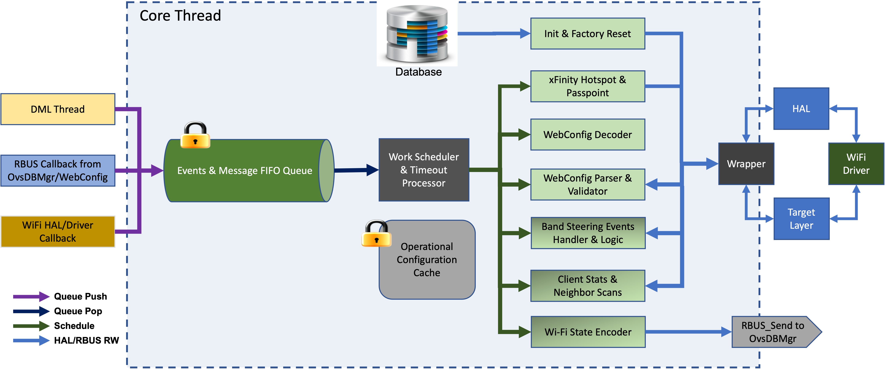

The core thread waits for events or messages, if there are events or messages in the FIFO queue, the thread retrieves the events or messages one after another and takes appropriate action. Three kinds of messages or events can be enqueued in the Core thread queue

South bound messages received from WebConfig Agent or Ovsdb Managervia RBUS callback.
South bound messages received from DML thread because of TR-181 set handler invocation
North bound asynchronous Wi-Fi events from HAL or driver isuch as
Client associations/disassociations
VAP or interface Up/Down
Registered 802.11mgmt frame reception
Band Steering events
All south bound messages are decoded, parsed and validated by core thread. In case, the messages are successfully validated, the core thread uses Wi-Fi HAL function to configure Wi-Fi driver or baseband accordingly. if successful, core thread is also resonsible for updating the persistent database so that in case of reboot or power failure, the Wi-Fi subsystem of the CPE device maintain previous operating configuration. Core thread also handles Wi-Fi or Factory reset commands that may be triggered by messages enqueued by DML thread or during initialization sequence.

All north bound events are translated to state update in ovddb state tables using WebConfig encoded messages sent by core to ovsdb manager.

### Core Thread Software Architecture

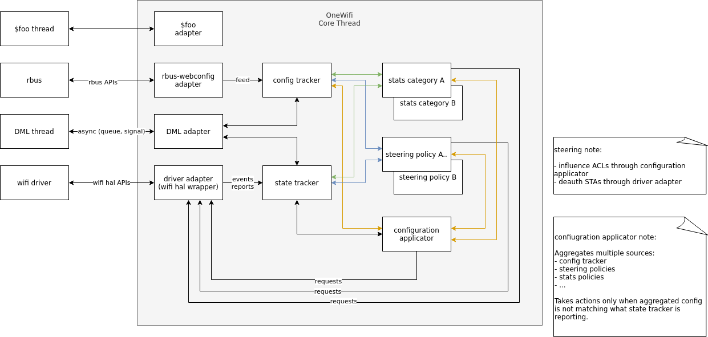

Some of the components described are as follows:

    **Config Tracker** - serves as an internal database for all Radio and VAP attributes. To be consumed by OneWifi internals, eg. stats policies, steering policies, configuration applicator, etc. Intended to be acting as a south bound interface and called by adapters to integrate them into specific systems, eg. rbus+webconfig.

    State Tracker - serves as a layer to shield OneWifi business logic modules from HAL API which is intended to not be fully object oriented.and to simplify its implementation, eg. event buffer overrun recovery handling, event order sanitization (sometimes implementations source events from multiple streams and their processing ordering is undefined).

    **Configuration Applicator** - uses inputs: Config Tracker and other mutators (coming from, eg. Stats or Steering policies) to generate configuration command(s) and submit them only if the assembled configuration command is out-of-sync with what State Tracker is reporting. Configuration Applicator is triggered for recompute by either Config Tracker, State Tracker or any of the registered mutators.

    Steering/Stats/Other policies - multiple entities implementing specific actions. Mostly interact with State Tracker, Configuration Applicator (as mutators), HAL wrapper (to perform world-visible actions) or between each other modules (Steering modules using some Stats).

    Rbus-webconfig adapter - adaptation logic which feeds Config Tracker based on Webconfig blobs. Essentially a translator to abstract Webconfig away from core logic. Foo thread / foo adapter - approach recommended on integrating other existing, or thread-heavy tasks. The OneWifi core is a single thread expecting no other threads interacting directly with its data structures or control flows, so adapters and their dispatch handlers are expected to be the entry/exit points between threads to simplify locking.

    HAL wrapper - virtually a HAL API that allows multiple backing implementations: Wifi HAL, Target API or other in the future. Intended to be mostly stateless and simple "pass through" - allowing out-of-order event delivery, etc. This allows simpler implementation for vendors. The task of sanitizing is handed to State Tracker for actual business logic consumers. The HAL wrapper API is highly aggregated (big blob call for configuration, singular calls for adequate actions like WPS PBC) with hints on which attributes are out-of-sync allowing implementations to optimize if desired. The wrapper is also capable of supporting multiple backing implementations at the same time (without requiring business logic implementation to be aware of any of that) to accommodate mixed vendor chips (on non-Wifi-Hal platforms) such as Broadcom + Quantenna.

All components are intended to schedule most of the actual work through separate dispatch handlers per object entities. This allows easy batching (to debounce and reduce ping-pong), time occupancy (to provide insight into possible stalls, or aid scheduling), forces idempotency (avoids some ab/ba logic issues, provides failure recovery procedures without additional explicit logic) and makes sure memory resource allocation is bound.

### Apps Functional Blocks Or Subsystem

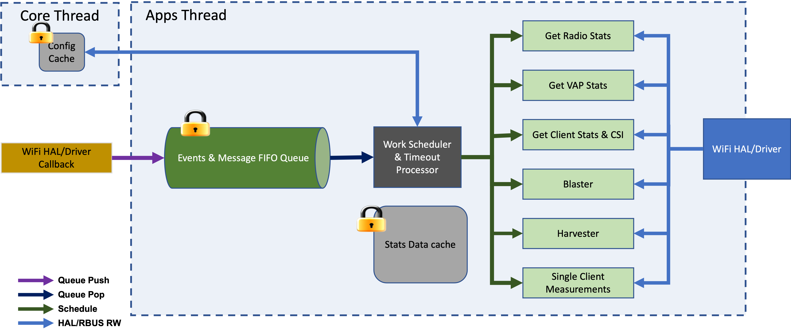

## Appendix

### OneWifi Schema Definition

#### SouthBound

(OvsDb Mgr/Webconfig/DML to OneWifi)

```c
{
    "DocName":"string",
    "SubDocName":"string",
    "Version":"string",
    "WifiConfig":{
        "GASConfig":[{
               "AdvertisementId":"int",
               "PauseForServerResp":"bool",
               "RespTimeout":"int",
               "ComebackDelay":"int",
               "RespBufferTime":"int",
               "QueryRespLengthLimit":"int"
        }]
    },
    "WifiRadioConfig":[{
        "RadioName":"string",
        "Enabled":"bool",
        "FreqBand":"int(enum)",
        "AutoChannelEnabled":"bool",
        "Channel":"int",
        "NumSecondaryChannels":"int",
        "SecondaryChannelsList":"string(CSV)",
        "ChannelWidth":"int(enum)",
        "HwMode":"int(enum)",
        "CsaBeaconCount":"int",
        "Country":"string(enum)",
        "DcsEnabled":"bool"
    }],
    "WifiVapConfig":[{
        "VapName":"string{e.g. private_ssid_<radio_band>|home_<radio_band>|hotspot_<radio_band> etc>}",
        "SSID":"string",
        "Mode":"string(ap/sta)",
        "Enabled":"bool",
        "SSIDAdvertisementEnabled":"bool",
        "IsolationEnable":"bool",
        "ManagementFramePowerControl":"int",
        "BssMaxNumSta":"int",
        "BSSTransitionActivated":"bool",
        "NeighborReportActivated":"bool",
        "RapidReconnThreshold":"int",
        "RapidReconnCountEnable":"bool",
        "VapStatsEnable":"bool",
        "Security":{
            "Mode":"string (None/WPA2-Personal/WPA2-Enterprise/WPA3/WPA3-Transition)",
            "Passphrase":"string",
            "EncryptionMethod":"string",
            "MFPConfig":"string {Disabled, Optional, Required}",
            "RadiusSettings":{
                "RadiusServerIPAddr":"string",
                "RadiusServerPort":"integer",
                "RadiusSecret":"string",
                "SecondaryRadiusServerIPAddr":"string",
                "SecondaryRadiusServerPort":"integer",
                "SecondaryRadiusSecret":"string"
            }
         },
         "Interworking":{
            "InterworkingEnable":"bool",
            "AccessNetworkType":"integer",
            "Internet":"bool",
            "ASRA":"bool",
            "ESR":"bool",
            "UESA":"bool",
            "HESSOptionPresent":"bool",
            "HESSID":"string",
            "Venue":{
               "VenueType":"int",
               "VenueGroup":"int"
            },
            "ANQP":{
                "IPAddressTypeAvailabilityANQPElement":{
                    "IPv6AddressType":"int",
                    "IPv4AddressType":"int"
                },
                "DomainANQPElement":{
                    "DomainName":[{
                        "Name":"string"
                     }
                  ]
               },
               "RoamingConsortiumANQPElement":{
                   "OI": [{
                           "OI": "string"
                       }
                   ]
               },
               "NAIRealmANQPElement":{
                   "Realm":[{
                        "RealmEncoding":"int",
                        "Realms":"string",
                        "EAP":[{
                            "Method":"int",
                            "AuthenticationParameter":[{
                                "ID":"int",
                                "Value":"string"
                            }]
                        }]
                   }]
               },
               "3GPPCellularANQPElement":{
                   "GUD":"int",
                   "PLMN":[{
                       "MCC":"3 digit string",
                       "MNC":"3 digit string"
                    }]
               },
               "VenueNameANQPElement":{
                   "VenueInfo":[{
                       "Language":"string",
                       "Name":"string"
                   }]
               }
            },
            "Passpoint":{
               "PasspointEnable":"bool",
               "GroupAddressedForwardingDisable":"bool",
               "P2pCrossConnectionDisable":"bool",
               "NAIHomeRealmANQPElement":{
                   "Realms":[{
                       "Encoding":"int",
                       "Name":"string"
                   }]
               },
               "OperatorFriendlyNameANQPElement":{
                   "Name":[{
                       "LanguageCode":"2 char string",
                       "OperatorName":"string"
                    }]
               },
               "ConnectionCapabilityListANQPElement":{
                   "ProtoPort":[{
                       "IPProtocol":"int",
                       "PortNumber":"int",
                       "Status":"int"
                    }]
               }
            }
         }
      }
   ]
}
```

### NorthBound

(OneWifi to OvsDb Mgr)

```c
{
    "Version":"3.0",
    "Wifi_Config":{
        "WifiRadioConfig":[
           {
             "RadioName":"radio1",
             "Enabled":true,
             "FreqBand":1,
             "AutoChannelEnabled":true,
             "Channel":11,
             "NumSecondaryChannels":2,
             "SecondaryChannelsList":"1,6",
             "ChannelWidth":1,
             "HwMode":1,
             "CsaBeaconCount":0,
             "Country":100,
             "DcsEnabled":true
             }
           ],
           "WifiVapConfig":[
           {
              "VapName":"hotspot_open_2g",
              "SSID":"xfinity",
              "Enabled":true,
              "SSIDAdvertisementEnabled":true,
              "IsolationEnable":true,
              "ManagementFramePowerControl":0,
              "BssMaxNumSta":5,
              "BSSTransitionActivated":false,
              "NeighborReportActivated":false,
              "RapidReconnThreshold":180,
              "RapidReconnCountEnable":false,
              "VapStatsEnable":false,
              "Security":{
                 "Mode":"None",
                 "Passphrase":"",
                 "EncryptionMethod":"AES",
                 "MFPConfig":"Disabled",
                 "RadiusSettings":{
                    "RadiusServerIPAddr":"0.0.0.0",
                    "RadiusServerPort":1812,
                    "RadiusSecret":"",
                    "SecondaryRadiusServerIPAddr":"0.0.0.0",
                    "SecondaryRadiusServerPort":1812,
                    "SecondaryRadiusSecret":""
                 }
              }
              }
           ]
    },
     
    "Wifi_State":{
      "Wifi_Radio_State":[
       {
        "if_name":"wl1",
        "freq_band":"5G",
        "enabled":true,
        "dfs_demo":true,
        "hw_type":"qca9882",
        "radar":"",
        "hw_config":"",
        "country":"US",
        "channel":157,
        "channel_mode":"auto",
        "mac":"11:22:33:44:55:66",
        "hw_mode":"11ac",
        "ht_mode":"HT40",
        "thermal_shutdown":83,
        "thermal_downgrade_temp":0,
        "thermal_upgrade_temp":0,
        "thermal_integration":0,
        "thermal_downgraded":false,
        "tx_power":20,
        "bcn_int":200,
        "tx_chainmask":3,
        "thermal_tx_chainmask":0,
        "allowed_channels":[36,40,44,48,52,56,60,64,100,104,108,112,116,120,124,128,132,136,140,149,153,157,161,165]
  },
  {
        "if_name":"wl2",
        "freq_band":"5G",
        "enabled":true,
        "dfs_demo":true,
        "hw_type":"qca9882",
        "radar":"",
        "hw_config":"",
        "country":"US",
        "channel":157,
        "channel_mode":"auto",
        "mac":"11:22:33:44:55:66",
        "hw_mode":"11ac",
        "ht_mode":"HT40",
        "thermal_shutdown":83,
        "thermal_downgrade_temp":0,
        "thermal_upgrade_temp":0,
        "thermal_integration":0,
        "thermal_downgraded":false,
        "tx_power":20,
        "bcn_int":200,
        "tx_chainmask":3,
        "thermal_tx_chainmask":0,
        "allowed_channels":[36,40,44,48,52,56,60,64,100,104,108,112,116,120,124,128,132,136,140,149,153,157,161,165]
  }
  ],
       "Wifi_VIF_State":[
          {
"enabled": true,
             "if_name":"wl1.1",
"mode": "ap",
"state":"",
"channel":157,
"mac":"52:6e:de:7d:28:9e",
"vif_radio_idx":2,
"wds":false,
"parent":"88:9e:68:62:1a:a6",
"ssid":"EasyMesh",
"ssid_broadcast":true,
"bridge":"br-home",
"mac_list":["set",["20:9a:7d:a3:e1:7f","20:9a:7d:a3:e1:80","30:93:bc:2e:21:3e","30:93:bc:ae:3a:a9","30:93:bc:ae:3a:aa","8c:fd:de:80:58:55", "8c:fd:de:80:58:56","d0:6e:de:88:6a:d2","d8:d7:75:ea:7f:4e", "e8:ad:a6:1c:7f:fe"]],
"mac_list_type":"whitelist",
             "associcated_clients":"",
             "vlan_id":1,
             "min_hw_mode":"11a",
             "uapsd_enable":true,
             "group_rekey":86400,
             "ap_brige":false,
             "ft_psk":0,
             "ft_mobility_domain":1,
"rrm":1,
"btm":1,
"dynamic_beacon":false,
  
"mcast2ucast":false,
"multi_ap":"none",
"ap_vlan_sta_addr":"",
"wps":false,
"wps_pbc":false,
"wps_pbc_key_id":"123456",
  
"wpa":true,
"wpa_key_mgmt":"",
"wpa_psks":"",
"radius_srv_addr":"0.0.0.0",
"radius_srv_port":1812,
"radius_srv_secret":"",
"dpp_connector":"",
"dpp_csign_hex":"",
"dpp_netaccesskey_hex":""
                        
          }
        ]
       }
}
```

## Flow Diagram Or Pseudo Code

Core Thread Pseudo Code


## Message Sequence Diagrams

### Initialization

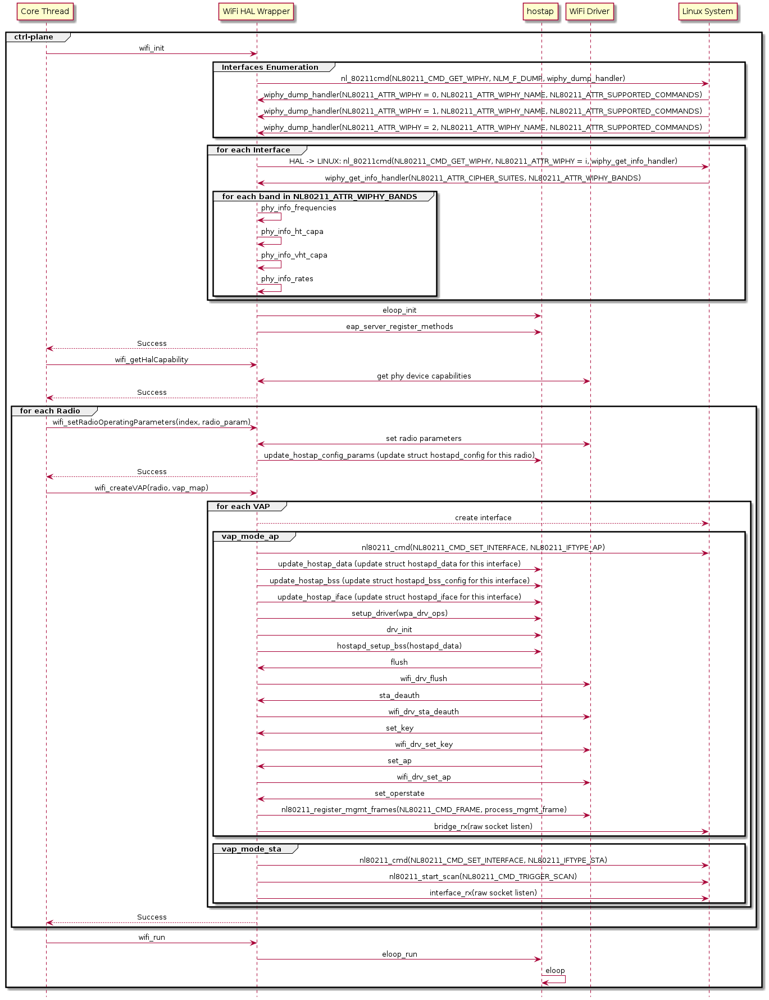

### Client Authentication

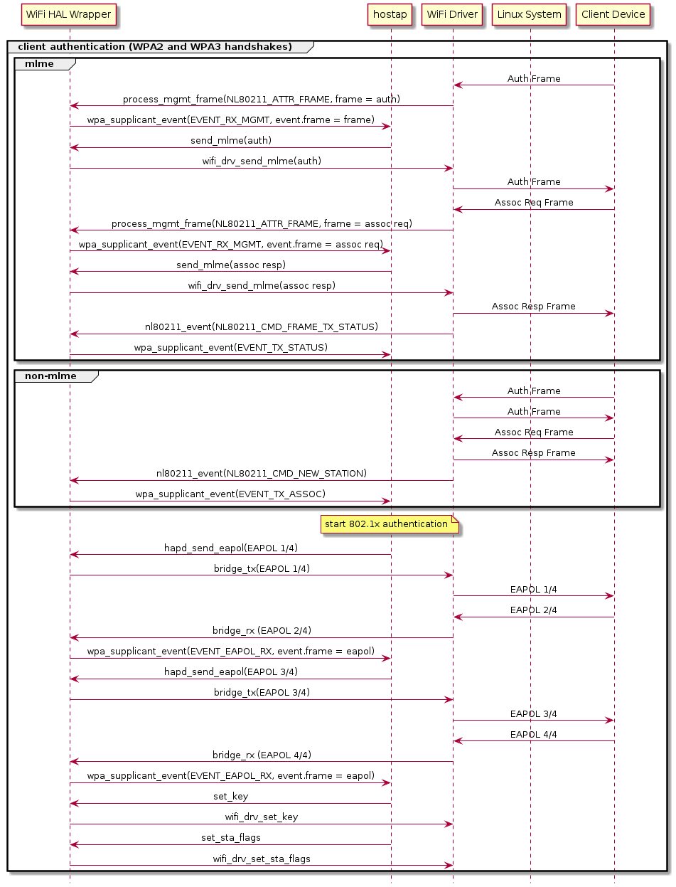
