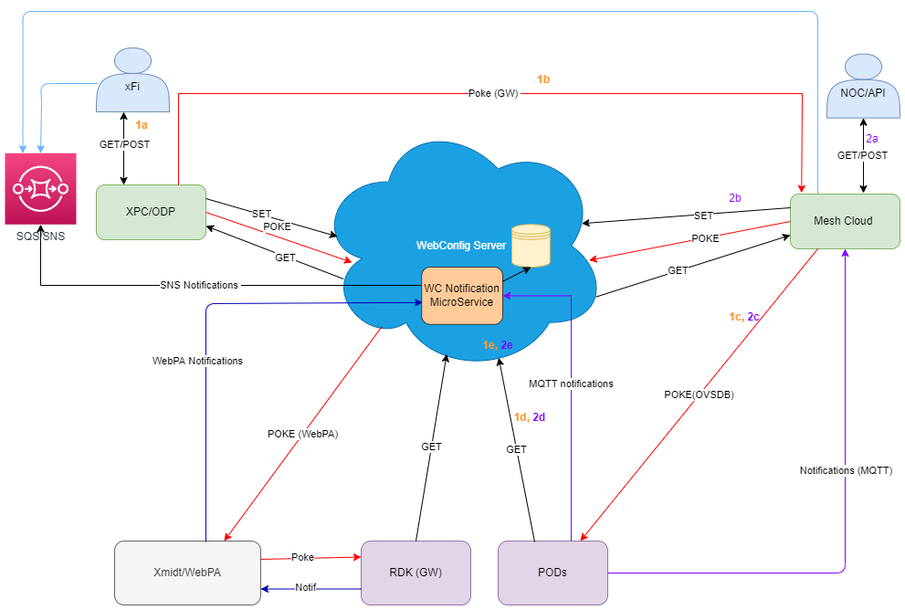

# GW & POD Config Management Using Webconfig

## History

| Date | Author | Comment | Version |
| --- | --- | --- | --- |
| 27/07/22 | M. Kandasamy | Draft | 0.0.1 |

## Table of Contents

- [Overview](#overview)
- [Architecture](#architecture)
  - [System Architecture](#system-architecture)
  - [Configurations Managed Over Webconfig](#configurations-managed-over-webconfig)
- [XFI Making Changes](#xfi-making-changes)
- [Controller Making Changes](#controller-making-changes)

## Overview

Describes how to configure the gateway and POD using Webconfig.

## Architecture

- No duplicate data models
- Controller will use OVSDB only for items that cannot use WebConfig
- PODs get their config info from WebConfig

### System Architecture

### Configurations Managed Over Webconfig

## XFI Making Changes

- XFi user makes changes to SSID/pass config.
- XPC sets SSID/Pass via Webconfig.
- WebConfig pokes RDK (WebPA Poke).
- When configs are applied successfully, XPC receives notifications and sends them to SQS.
- Controller listens to this Notification.
- Controller gather locations devices and issue pokes on pods via  OVSDB.

## Controller Making Changes

- Set configs using WebConfig API to WebConfig.
- Poke GW using Webconfig Poke API (GW poke will always be over WebPA).
- XPC will notify on the application of config.
- Controller already knows locations’ devices and will issue pokes on pods via ovsdb.
