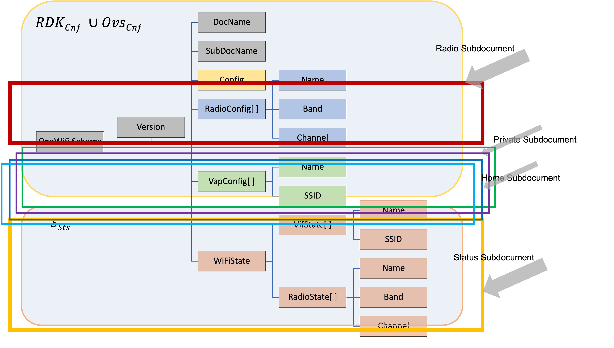

# Wi-Fi WebConfig

## History

| Date | Author | Comment | Version |
| --- | --- | --- | --- |
| 26/07/22 | M. Kandasamy | Draft | 0.0.1 |

## Table of Contents

- [Overview](#overview)
- [Architecture](#architecture)
  - [Systems Architecture](#systems-architecture)
  - [WebConfig Architecture in OneWifi](#webconfig-architecture-in-onewifi)
- [Appendix](#appendix)
  - [WiFi Schema Subdocuments](#wifi-schema-subdocuments)
    - [Radio](#radio-subdocument-schema)
    - [Private](#private-subdocument-schema)
    - [Xfinity](#xfinity-subdocument-schema)
    - [Mesh](#mesh-subdocument-schema)
    - [Associated clients](#associated-clients-subdocument-schema)

## Overview

WebConfig is the chosen mechanism of configuring operational and other configuration parameters in RDK-B Wifi stack. The mechanism essentially involves formatting configuration data in JSON format and sending the data over to OneWifi process in RDK-B gateway. RDK-B gateway parses, validates and apples the data in over layer WiFi drivers using HAL functions. Subsequently the changed configuration is notified to subscribed applications/components using same JSON formatted data.

## Architecture

### Systems Architecture

The overall systems architecture can be found in [GW & POD config management using Webconfig](rdkbWifiStackGwPodConfigMgmt.md).
The JSON document that is the content of all Wifi configuration parameters is defined by schema. The definition of this WiFi schema is in the Appendix section. Different parts and pieces of this schema can be used in different combinations for different use cases. A visual representation of the concept of Subdocuments as it relates to schema is depicted below.



This use case specific schema definitions is referred to as SubDocuments. The SubDocuments and the corresponding schema object contents are tabulated below.

| SubDocument               | Objects                                                                                                                                                                                                                                                | Object Instances                                                                               | Source        | Destination                                                                                                                              | Use Case                                                                                    |
|---------------------------|--------------------------------------------------------------------------------------------------------------------------------------------------------------------------------------------------------------------------------------------------------|------------------------------------------------------------------------------------------------|---------------|------------------------------------------------------------------------------------------------------------------------------------------|---------------------------------------------------------------------------------------------|
| dml                       | WiFiConfig                                                                                                                                                                                                                                             | OneWifi                                                                                        | Ovsdbmgr, DML | Initial synchronization of WiFi operational data between OneWifi and interested applications or components (e.g.DML thread or Ovsdbmgr). |                                                                                             |
| WiFiRadioConfig           | radio1, radio2                                                                                                                                                                                                                                         |                                                                                                |               |                                                                                                                                          |                                                                                             |
| WiFiVapConfig             | private_ssid_2g, private_ssid_5g, iot_ssid_2g, iot_ssid_5g, hotspot_open_2g, hotspot_open_5g, lnf_psk_2g, lnf_psk_5g, hotspot_secure_2g, hotspot_secure_5g, lnf_radius_2g, lnf_radius_5g, mesh_backhaul_2g, mesh_backhaul_5g, mesh_sta_2g, mesh_sta_5g |                                                                                                |               |                                                                                                                                          |                                                                                             |
| WiFiRadioState            | Not including this object for now                                                                                                                                                                                                                      |                                                                                                |               |                                                                                                                                          |                                                                                             |
| WiFiVapState              | Not including this object for now                                                                                                                                                                                                                      |                                                                                                |               |                                                                                                                                          |                                                                                             |
| WiFiClients               |                                                                                                                                                                                                                                                        |                                                                                                |               |                                                                                                                                          |                                                                                             |
| private                   | WiFiVapConfig                                                                                                                                                                                                                                          | private_ssid_2g, private_ssid_5g                                                               | ODP, DML      | OneWifi                                                                                                                                  | Configuration of private SSID/password parameters from cloud or dmcli                       |
| xfinity                   | WiFiVapConfig                                                                                                                                                                                                                                          | hotspot_open_2g, hotspot_open_5g, hotspot_secure_2g, hotspot_secure_5g                         | ODP, DML      | OneWifi                                                                                                                                  | Configuration of xfinity SSID/security parameters from cloud or dmcli.                      |
| home                      | WiFiVapConfig                                                                                                                                                                                                                                          | iot_ssid_2g, iot_ssid_5g                                                                       | ODP, DML      | OneWifi                                                                                                                                  | Configuration of security parameters of IOT VAP from Comcast cloud.                         |
| mesh                      | WiFiVapConfig                                                                                                                                                                                                                                          | mesh_backhaul_2g, mesh_backhaul_5g, mesh_sta_2g, mesh_sta_5g                                   | Ovsdbmgr, DML | Onewifi                                                                                                                                  | Configuration of STA or backhaul VAP parameters from Ovsdbmgr/Controller                    |
| sta                       | WiFiVapConfig                                                                                                                                                                                                                                          | mesh_sta_2g, mesh_sta_5g                                                                       | DML           | OneWifi                                                                                                                                  |                                                                                             |
| radio                     | WiFiRadioConfig                                                                                                                                                                                                                                        | radio1, radio2                                                                                 | Ovsdbmgr, DML | OneWifi                                                                                                                                  | Configuration of radio parameters like channel from Ovsdbmgr/Controller or dmcli            |
| associated clients        | WiFiAssociatedClients                                                                                                                                                                                                                                  | private_ssid_2g, private_ssid_5g, mesh_backhaul_2g, mesh_backhaul_5g, mesh_sta_2g, mesh_sta_5g | OneWifi       | Ovsdbmgr, DML                                                                                                                            | Notification of list of associated clients by OneWifi to interested components/applications |
| config                    | WiFiConfig                                                                                                                                                                                                                                             | DML                                                                                            | OneWifi       | Notification from DML to OneWifi for global parameter updates.                                                                           |                                                                                             |
| blaster                   | WiFiBlaster                                                                                                                                                                                                                                            | ODP, DML                                                                                       | OneWifi       | Configuration of blaster parameters from ODP to OneWifi                                                                                  |                                                                                             |
| single client measurement | WiFiClientMeasurement                                                                                                                                                                                                                                  | ODP, DML                                                                                       | OneWifi       |                                                                                                                                          |                                                                                             |

### WebConfig Architecture in OneWifi

(TODO: ?? missing content)

## Appendix

### WiFi Schema Subdocuments

#### Radio Subdocument Schema

```c
{
    "Version":  "1.0",
    "SubDocName":   "radio",
    "WifiRadioConfig":  [{
            "WifiRadioSetup":   {
                "RadioIndex":   0,
                "VapMap":   [{
                        "VapName":  "private_ssid_2g",
                        "VapIndex": 0
                    }, {
                        "VapName":  "iot_ssid_2g",
                        "VapIndex": 2
                    }, {
                        "VapName":  "hotspot_open_2g",
                        "VapIndex": 4
                    }, {
                        "VapName":  "lnf_psk_2g",
                        "VapIndex": 6
                    }, {
                        "VapName":  "hotspot_secure_2g",
                        "VapIndex": 8
                    }, {
                        "VapName":  "lnf_radius_2g",
                        "VapIndex": 10
                    }, {
                        "VapName":  "mesh_backhaul_2g",
                        "VapIndex": 12
                    }, {
                        "VapName":  "mesh_sta_2g",
                        "VapIndex": 14
                    }]
            },
            "RadioName":    "radio1",
            "Enabled":  true,
            "FreqBand": 1,
            "AutoChannelEnabled":   true,
            "Channel":  3,
            "NumSecondaryChannels": 0,
            "SecondaryChannelsList":    " ",
            "ChannelWidth": 1,
            "HwMode":   4,
            "CsaBeaconCount":   0,
            "Country":  "US",
            "DcsEnabled":   false,
            "DtimPeriod":   2,
            "OperatingClass":   0,
            "BasicDataTransmitRates":   0,
            "OperationalDataTransmitRates": 0,
            "FragmentationThreshold":   2346,
            "GuardInterval":    16,
            "TransmitPower":    100,
            "BeaconInterval":   100,
            "RtsThreshold": 2347,
            "FactoryResetSsid": false,
            "RadioStatsMeasuringRate":  0,
            "RadioStatsMeasuringInterval":  0,
            "CtsProtection":    false,
            "ObssCoex": true,
            "StbcEnable":   true,
            "GreenFieldEnable": false,
            "UserControl":  1,
            "AdminControl": 254,
            "ChanUtilThreshold":    90,
            "ChanUtilSelfHealEnable":   false
        }, {
            "WifiRadioSetup":   {
                "RadioIndex":   1,
                "VapMap":   [{
                        "VapName":  "private_ssid_5g",
                        "VapIndex": 1
                    }, {
                        "VapName":  "iot_ssid_5g",
                        "VapIndex": 3
                    }, {
                        "VapName":  "hotspot_open_5g",
                        "VapIndex": 5
                    }, {
                        "VapName":  "lnf_psk_5g",
                        "VapIndex": 7
                    }, {
                        "VapName":  "hotspot_secure_5g",
                        "VapIndex": 9
                    }, {
                        "VapName":  "lnf_radius_5g",
                        "VapIndex": 11
                    }, {
                        "VapName":  "mesh_backhaul_5g",
                        "VapIndex": 13
                    }, {
                        "VapName":  "mesh_sta_5g",
                        "VapIndex": 15
                    }]
            },
            "RadioName":    "radio2",
            "Enabled":  true,
            "FreqBand": 2,
            "AutoChannelEnabled":   true,
            "Channel":  36,
            "NumSecondaryChannels": 0,
            "SecondaryChannelsList":    " ",
            "ChannelWidth": 1,
            "HwMode":   1,
            "CsaBeaconCount":   0,
            "Country":  "US",
            "DcsEnabled":   false,
            "DtimPeriod":   2,
            "OperatingClass":   0,
            "BasicDataTransmitRates":   0,
            "OperationalDataTransmitRates": 0,
            "FragmentationThreshold":   2346,
            "GuardInterval":    16,
            "TransmitPower":    100,
            "BeaconInterval":   100,
            "RtsThreshold": 2347,
            "FactoryResetSsid": false,
            "RadioStatsMeasuringRate":  0,
            "RadioStatsMeasuringInterval":  0,
            "CtsProtection":    false,
            "ObssCoex": true,
            "StbcEnable":   true,
            "GreenFieldEnable": false,
            "UserControl":  1,
            "AdminControl": 254,
            "ChanUtilThreshold":    90,
            "ChanUtilSelfHealEnable":   false
        }]
}
```

#### Private Subdocument Schema

```c
{
        "Version":      "1.0",
        "SubDocName":   "private",
        "WifiVapConfig":        [{
                        "VapName":      "private_ssid_2g",
                        "BridgeName":   "brlan0",
                        "RadioIndex":   0,
                        "VapMode":      0,
                        "SSID": "--AD1D_WCSD_24",
                        "BSSID": "11:22:33:44:55:66",
                        "Enabled":      true,
                        "SSIDAdvertisementEnabled":     true,
                        "IsolationEnable":      false,
                        "ManagementFramePowerControl":  0,
                        "BssMaxNumSta": 75,
                        "BSSTransitionActivated":       true,
                        "NeighborReportActivated":      true,
                        "RapidReconnCountEnable":       false,
                        "RapidReconnThreshold": 180,
                        "VapStatsEnable":       true,
                        "MacFilterEnable":      false,
                        "MacFilterMode":        0,
                        "WmmEnabled":   true,
                        "UapsdEnabled": true,
                        "BeaconRate":   0,
                        "WmmNoAck":     1,
                        "WepKeyLength": 128,
                        "BssHotspot":   false,
                        "WpsPushButton":        1,
                        "WpsEnable":    false,
                        "BeaconRateCtl":        "6Mbps",
                        "Security":     {
                                "MFPConfig":    "Optional",
                                "Mode": "WPA3-Personal-Transition",
                                "EncryptionMethod":     "AES",
                                "Passphrase":   "Password123"
                        },
                        "Interworking": {
                                "InterworkingEnable":   false,
                                "AccessNetworkType":    0,
                                "Internet":     true,
                                "ASRA": false,
                                "ESR":  false,
                                "UESA": false,
                                "HESSOptionPresent":    true,
                                "HESSID":       "11:22:33:44:55:66",
                                "Venue":        {
                                        "VenueType":    0,
                                        "VenueGroup":   0
                                }
                        }
                }, {
                        "VapName":      "private_ssid_5g",
                        "BridgeName":   "brlan0",
                        "RadioIndex":   1,
                        "VapMode":      0,
                        "SSID": "--AD1D_WCSD_5",
                        "BSSID": "11:22:33:44:55:67",
                        "Enabled":      true,
                        "SSIDAdvertisementEnabled":     true,
                        "IsolationEnable":      false,
                        "ManagementFramePowerControl":  0,
                        "BssMaxNumSta": 75,
                        "BSSTransitionActivated":       true,
                        "NeighborReportActivated":      true,
                        "RapidReconnCountEnable":       true,
                        "RapidReconnThreshold": 180,
                        "VapStatsEnable":       true,
                        "MacFilterEnable":      false,
                        "MacFilterMode":        0,
                        "WmmEnabled":   true,
                        "UapsdEnabled": true,
                        "BeaconRate":   0,
                        "WmmNoAck":     1,
                        "WepKeyLength": 128,
                        "BssHotspot":   false,
                        "WpsPushButton":        1,
                        "WpsEnable":    false,
                        "BeaconRateCtl":        "6Mbps",
                        "Security":     {
                                "MFPConfig":    "Optional",
                                "Mode": "WPA3-Personal-Transition",
                                "EncryptionMethod":     "AES",
                                "Passphrase":   "Password123"
                        },
                        "Interworking": {
                                "InterworkingEnable":   false,
                                "AccessNetworkType":    0,
                                "Internet":     true,
                                "ASRA": false,
                                "ESR":  false,
                                "UESA": false,
                                "HESSOptionPresent":    true,
                                "HESSID":       "11:22:33:44:55:66",
                                "Venue":        {
                                        "VenueType":    0,
                                        "VenueGroup":   0
                                }
                        }
                }]
}


```

#### Xfinity Subdocument Schema

```c
{
        "Version":      "1.0",
        "SubDocName":   "xfinity",
        "WifiVapConfig":        [{
                        "VapName":      "hotspot_open_2g",
                        "BridgeName":   "brlan2",
                        "RadioIndex":   0,
                        "VapMode":      0,
                        "SSID": "--AD1D_xfinity24",
                        "BSSID": "11:22:33:44:55:91",
                        "Enabled":      true,
                        "SSIDAdvertisementEnabled":     true,
                        "IsolationEnable":      false,
                        "ManagementFramePowerControl":  3,
                        "BssMaxNumSta": 5,
                        "BSSTransitionActivated":       true,
                        "NeighborReportActivated":      true,
                        "RapidReconnCountEnable":       true,
                        "RapidReconnThreshold": 180,
                        "VapStatsEnable":       true,
                        "MacFilterEnable":      false,
                        "MacFilterMode":        0,
                        "WmmEnabled":   true,
                        "UapsdEnabled": false,
                        "BeaconRate":   32,
                        "WmmNoAck":     2,
                        "WepKeyLength": 128,
                        "BssHotspot":   false,
                        "WpsPushButton":        0,
                        "WpsEnable":    false,
                        "BeaconRateCtl":        "6Mbps",
                        "Security":     {
                                "Mode": "None"
                        },
                        "Interworking": {
                                "InterworkingEnable":   false,
                                "AccessNetworkType":    5,
                                "Internet":     false,
                                "ASRA": true,
                                "ESR":  true,
                                "UESA": false,
                                "HESSOptionPresent":    false,
                                "HESSID":       "11:22:33:44:55:77",
                                "Venue":        {
                                        "VenueType":    5,
                                        "VenueGroup":   5
                                }
                        }
                }, {
                        "VapName":      "hotspot_secure_2g",
                        "BridgeName":   "brlan4",
                        "RadioIndex":   0,
                        "VapMode":      0,
                        "SSID": "--AD1D_XFINITY24",
                        "BSSID": "11:22:33:44:55:92",
                        "Enabled":      true,
                        "SSIDAdvertisementEnabled":     true,
                        "IsolationEnable":      false,
                        "ManagementFramePowerControl":  3,
                        "BssMaxNumSta": 9,
                        "BSSTransitionActivated":       true,
                        "NeighborReportActivated":      true,
                        "RapidReconnCountEnable":       true,
                        "RapidReconnThreshold": 180,
                        "VapStatsEnable":       true,
                        "MacFilterEnable":      false,
                        "MacFilterMode":        0,
                        "WmmEnabled":   false,
                        "UapsdEnabled": false,
                        "BeaconRate":   32,
                        "WmmNoAck":     2,
                        "WepKeyLength": 128,
                        "BssHotspot":   false,
                        "WpsPushButton":        0,
                        "WpsEnable":    false,
                        "BeaconRateCtl":        "6Mbps",
                        "Security":     {
                                "MFPConfig":    "Disabled",
                                "Mode": "WPA2-Enterprise",
                                "EncryptionMethod":     "AES",
                                "Wpa3_transition_disable":      false,
                                "RekeyInterval":        0,
                                "StrictRekey":  false,
                                "EapolKeyTimeout":      0,
                                "EapolKeyRetries":      0,
                                "EapIdentityReqTimeout":        0,
                                "EapIdentityReqRetries":        0,
                                "EapReqTimeout":        0,
                                "EapReqRetries":        0,
                                "DisablePmksaCaching":  false,
                                "RadiusSettings":       {
                                        "RadiusServerIPAddr":   "96.114.36.108",
                                        "RadiusServerPort":     1812,
                                        "RadiusSecret": "tCnx3DrzP!kZfhM8vbiJ",
                                        "SecondaryRadiusServerIPAddr":  "96.114.36.108",
                                        "SecondaryRadiusServerPort":    1812,
                                        "SecondaryRadiusSecret":        "tCnx3DrzP!kZfhM8vbiJ",
                                        "DasServerIPAddr":      "96.114.38.232",
                                        "DasServerPort":        3799,
                                        "DasSecret":    "tCnx3DrzP!kZfhM8vbiJ",
                                        "MaxAuthAttempts":      0,
                                        "BlacklistTableTimeout":        0,
                                        "IdentityReqRetryInterval":     0,
                                        "ServerRetries":        0
                                }
                        },
                        "Interworking": {
                                "InterworkingEnable":   false,
                                "AccessNetworkType":    0,
                                "Internet":     false,
                                "ASRA": true,
                                "ESR":  true,
                                "UESA": false,
                                "HESSOptionPresent":    false,
                                "HESSID":       "11:22:33:44:99:77",
                                "Venue":        {
                                        "VenueType":    0,
                                        "VenueGroup":   9
                                }
                        }
                }, {
                        "VapName":      "hotspot_open_5g",
                        "BridgeName":   "brlan3",
                        "RadioIndex":   1,
                        "VapMode":      0,
                        "SSID": "--AD1D_xfinity5",
                        "BSSID": "11:22:33:44:55:93",
                        "Enabled":      true,
                        "SSIDAdvertisementEnabled":     true,
                        "IsolationEnable":      false,
                        "ManagementFramePowerControl":  3,
                        "BssMaxNumSta": 5,
                        "BSSTransitionActivated":       true,
                        "NeighborReportActivated":      true,
                        "RapidReconnCountEnable":       true,
                        "RapidReconnThreshold": 180,
                        "VapStatsEnable":       true,
                        "MacFilterEnable":      false,
                        "MacFilterMode":        0,
                        "WmmEnabled":   true,
                        "UapsdEnabled": false,
                        "BeaconRate":   32,
                        "WmmNoAck":     2,
                        "WepKeyLength": 128,
                        "BssHotspot":   false,
                        "WpsPushButton":        0,
                        "WpsEnable":    false,
                        "BeaconRateCtl":        "6Mbps",
                        "Security":     {
                                "Mode": "None"
                        },
                        "Interworking": {
                                "InterworkingEnable":   false,
                                "AccessNetworkType":    5,
                                "Internet":     false,
                                "ASRA": true,
                                "ESR":  true,
                                "UESA": false,
                                "HESSOptionPresent":    false,
                                "HESSID":       "11:22:33:44:55:77",
                                "Venue":        {
                                        "VenueType":    5,
                                        "VenueGroup":   5
                                }
                        }
                }, {
                        "VapName":      "hotspot_secure_5g",
                        "BridgeName":   "brlan5",
                        "RadioIndex":   1,
                        "VapMode":      0,
                        "SSID": "--AD1D_XFINITY5",
                        "BSSID": "11:22:33:44:55:94",
                        "Enabled":      true,
                        "SSIDAdvertisementEnabled":     true,
                        "IsolationEnable":      false,
                        "ManagementFramePowerControl":  3,
                        "BssMaxNumSta": 9,
                        "BSSTransitionActivated":       true,
                        "NeighborReportActivated":      true,
                        "RapidReconnCountEnable":       true,
                        "RapidReconnThreshold": 180,
                        "VapStatsEnable":       true,
                        "MacFilterEnable":      false,
                        "MacFilterMode":        0,
                        "WmmEnabled":   false,
                        "UapsdEnabled": false,
                        "BeaconRate":   32,
                        "WmmNoAck":     2,
                        "WepKeyLength": 128,
                        "BssHotspot":   false,
                        "WpsPushButton":        0,
                        "WpsEnable":    false,
                        "BeaconRateCtl":        "6Mbps",
                        "Security":     {
                                "MFPConfig":    "Disabled",
                                "Mode": "WPA2-Enterprise",
                                "EncryptionMethod":     "AES",
                                "Wpa3_transition_disable":      false,
                                "RekeyInterval":        0,
                                "StrictRekey":  false,
                                "EapolKeyTimeout":      0,
                                "EapolKeyRetries":      0,
                                "EapIdentityReqTimeout":        0,
                                "EapIdentityReqRetries":        0,
                                "EapReqTimeout":        0,
                                "EapReqRetries":        0,
                                "DisablePmksaCaching":  false,
                                "RadiusSettings":       {
                                        "RadiusServerIPAddr":   "96.114.36.108",
                                        "RadiusServerPort":     1812,
                                        "RadiusSecret": "tCnx3DrzP!kZfhM8vbiJ",
                                        "SecondaryRadiusServerIPAddr":  "96.114.36.108",
                                        "SecondaryRadiusServerPort":    1812,
                                        "SecondaryRadiusSecret":        "tCnx3DrzP!kZfhM8vbiJ",
                                        "DasServerIPAddr":      "96.114.38.232",
                                        "DasServerPort":        3799,
                                        "DasSecret":    "tCnx3DrzP!kZfhM8vbiJ",
                                        "MaxAuthAttempts":      0,
                                        "BlacklistTableTimeout":        0,
                                        "IdentityReqRetryInterval":     0,
                                        "ServerRetries":        0
                                }
                        },
                        "Interworking": {
                                "InterworkingEnable":   false,
                                "AccessNetworkType":    2,
                                "Internet":     false,
                                "ASRA": true,
                                "ESR":  true,
                                "UESA": false,
                                "HESSOptionPresent":    false,
                                "HESSID":       "11:22:33:44:99:77",
                                "Venue":        {
                                        "VenueType":    0,
                                        "VenueGroup":   9
                                }
                        }
                }]
}

```

#### Mesh Subdocument Schema

```c
{
    "Version":  "1.0",
    "SubDocName":   "mesh",
    "WifiVapConfig":    [{
            "VapName":  "mesh_backhaul_2g",
            "BridgeName":   "brlan1",
            "RadioIndex":   0,
            "VapMode":  0,
            "SSID": "test_mesh_backhaul_2g",
            "Enabled":  true,
            "SSIDAdvertisementEnabled": true,
            "IsolationEnable":  false,
            "ManagementFramePowerControl":  0,
            "BssMaxNumSta": 0,
            "BSSTransitionActivated":   false,
            "NeighborReportActivated":  false,
            "RapidReconnCountEnable":   false,
            "RapidReconnThreshold": 0,
            "VapStatsEnable":   false,
            "MacFilterEnable":  false,
            "MacFilterMode":    0,
            "WmmEnabled":   false,
            "UapsdEnabled": false,
            "BeaconRate":   0,
            "WmmNoAck": 0,
            "WepKeyLength": 0,
            "BssHotspot":   false,
            "WpsPushButton":    0,
            "BeaconRateCtl":    "12345",
            "Security": {
                "MFPConfig":    "Disabled",
                "Mode": "WPA2-Personal",
                "EncryptionMethod": "AES",
                "Passphrase":   "test1webconf"
            },
            "Interworking": {
                "InterworkingEnable":   false,
                "AccessNetworkType":    0,
                "Internet": false,
                "ASRA": false,
                "ESR":  false,
                "UESA": false,
                "HESSOptionPresent":    false,
                "HESSID":   "11:22:33:44:55:66",
                "Venue":    {
                    "VenueType":    0,
                    "VenueGroup":   0
                }
            }
        }, {
            "VapName":  "mesh_sta_2g",
            "BridgeName":   "brlan1",
            "VapMode":  1,
            "RadioIndex":   0,
            "SSID": "test_mesh_sta_2g",
            "BSSID":    "00:00:00:00:00:00",
            "Security": {
                "MFPConfig":    "Disabled",
                "Mode": "WPA2-Personal",
                "EncryptionMethod": "AES",
                "Passphrase":   "test1webconf"
            },
            "ScanParameters":   {
                "Period":   2,
                "Channel":  0
            }
        }, {
            "VapName":  "mesh_backhaul_5g",
            "BridgeName":   "brlan1",
            "RadioIndex":   1,
            "VapMode":  0,
            "SSID": "test_mesh_backhaul_5g",
            "Enabled":  true,
            "SSIDAdvertisementEnabled": true,
            "IsolationEnable":  false,
            "ManagementFramePowerControl":  0,
            "BssMaxNumSta": 0,
            "BSSTransitionActivated":   false,
            "NeighborReportActivated":  false,
            "RapidReconnCountEnable":   false,
            "RapidReconnThreshold": 0,
            "VapStatsEnable":   false,
            "MacFilterEnable":  false,
            "MacFilterMode":    0,
            "WmmEnabled":   false,
            "UapsdEnabled": false,
            "BeaconRate":   0,
            "WmmNoAck": 0,
            "WepKeyLength": 0,
            "BssHotspot":   false,
            "WpsPushButton":    0,
            "BeaconRateCtl":    "12345",
            "Security": {
                "MFPConfig":    "Disabled",
                "Mode": "WPA2-Personal",
                "EncryptionMethod": "AES",
                "Passphrase":   "test1webconf"
            },
            "Interworking": {
                "InterworkingEnable":   false,
                "AccessNetworkType":    0,
                "Internet": false,
                "ASRA": false,
                "ESR":  false,
                "UESA": false,
                "HESSOptionPresent":    false,
                "HESSID":   "11:22:33:44:55:66",
                "Venue":    {
                    "VenueType":    0,
                    "VenueGroup":   0
                }
            }
        }, {
            "VapName":  "mesh_sta_5g",
            "BridgeName":   "brlan1",
            "VapMode":  1,
            "RadioIndex":   1,
            "SSID": "test_mesh_sta_5g",
            "BSSID":    "00:00:00:00:00:00",
            "Security": {
                "MFPConfig":    "Disabled",
                "Mode": "WPA2-Personal",
                "EncryptionMethod": "AES",
                "Passphrase":   "test1webconf"
            },
            "ScanParameters":   {
                "Period":   2,
                "Channel":  0
            }
        }]
}

```

#### Associated clients Subdocument Schema

```c
{
    "Version":"1.0",
    "SubDocName":"associated clients",
    "WiFiAssociatedClients":[{
        "VapName":"string{e.g. private_ssid_<radio_band>|home_<radio_band>|hotspot_<radio_band> etc>}",
        "asocciatedClients":[{
            "MACAddress":"string{MAC address of associated client eg:AA:BB:CC:DD:EE:FF}",
            "AuthenticationState":"bool",
            "LastDataDownlinkRate":"unsigned int[1000:600000]",
            "LastDataUplinkRate":"unsigned int[1000:600000]",
            "SignalStrength":"int[-200:0]",
            "Retransmissions":"unsigned int[0:100]",
            "Active":"bool",
            "OperatingStandard":"string",
            "OperatingChannelBandwidth":"string",
            "SNR":"int[0:100]",
            "InterferenceSources":"string",
            "DataFramesSentAck":"unsigned int",
            "DataFramesSentNoAck":"unsigned int",
            "BytesSent":"unsigned int",
            "BytesReceived":"unsigned int",
            "RSSI":"int",
            "MinRSSI":"int",
            "MaxRSSI":"int",
            "Disassociations":"unsigned int",
            "AuthenticationFailures":"unsigned int",
            "PacketsSent":"unsigned int",
            "PacketsReceived":"unsigned int",
            "ErrorsSent" :"unsigned int",
            "RetransCount":"unsigned int",
            "FailedRetransCount":"unsigned int",
            "RetryCount":"unsigned int",
            "MultipleRetryCount":"unsigned int",
        }]
    }]
}

```
